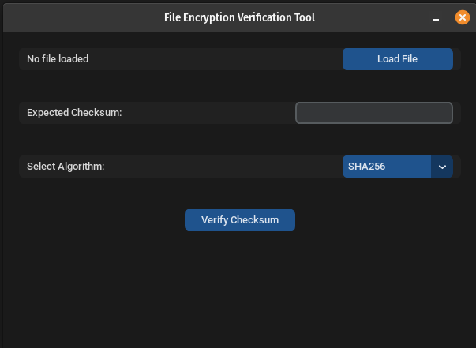

<small>python version 3.10.12</small>

<h3 align="center">  hashVarGui.py</h3>
<h3 align="center"> Using...</h3>
    

    <picture>
        <source media="(prefers-color-scheme: dark)" srcset="./images/CustomTkinter_logo_dark.png">
        
    </picture>
    

--> [https://github.com/TomSchimansky/CustomTkinter]<--

## 

<h3 align="center">  1.) Run the Application...</h3>
<h3 align="center">v0.1.0</h4>
    

